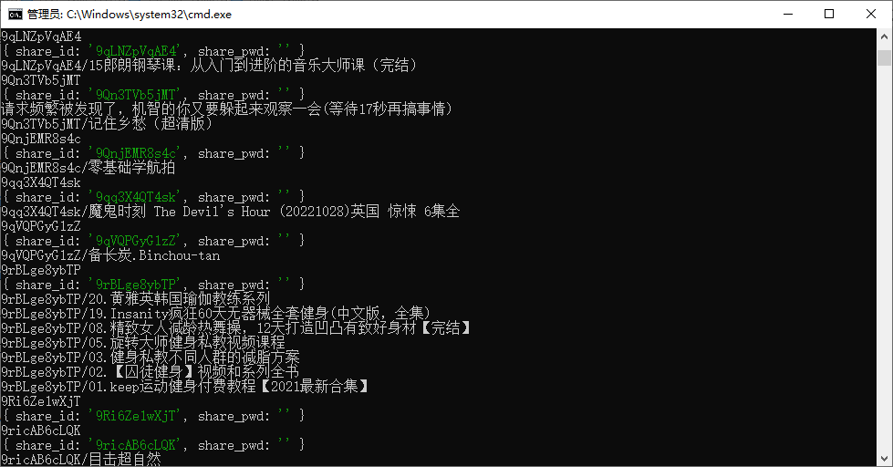
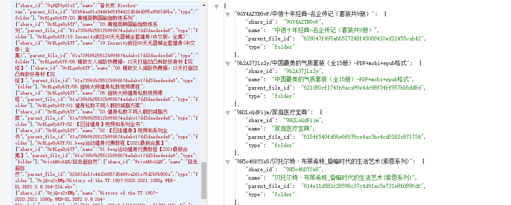

# alidriver-share-list
用来显示阿里云盘共享连接里面有些什么内容

#### 环境建立
npm install axios

#### 命令行
node aliDir.js 目录深度0表示只列出第一级别999 应该能列出所有了  输入文件input.txt  输出文件outinfo.json 
例如
node aliDir.js 2 input.txt outinfo.json

#### 刷新顶层文件夹
node aliDir.js 0 input.txt outinfo.json

#### 刷新全部目录
node aliDir.js 999 input.txt outinfo.json

大量请求比较容易被服务器拒绝，大家轻点玩

###命令行

###输出结果

### 申明

- 本项目仅做学习交流, 禁止用于各种非法途径
- 项目中的所有内容均源于互联网, 仅限于小范围内学习参考, 如有侵权请第一时间联系 [本项目作者](https://github.com/tangjiangjie) 进行删除

